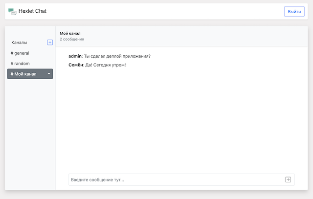

[](https://github.com/Foppp/frontend-project-lvl4/actions)

# Slack Chat App
## Analogue of Slack chat (Simplified version). The main task is to learn how to write components in React, organize work with state through Redux, configure web sockets, client routing, authorization and authentication.

#### Main language RU (EN optional)

* React and Redux Toolkit 
* Interaction with the server via REST API
* JWT authorization / authentication
* Real time messaging over websocket (socket.io)
* Using React Router to control the application
* Using React (hooks, context, direct DOM interaction)
* Using Redux (reduxjs / redux-toolkit)
* Validation (Yup, Formik)
* Using i18-next to organize texts, locales
* Using react-bootstrap library
* NPM, Babel, ESlint
* Build Webpack
* Deploy Heroku

## [Check Example Here](https://slack-chat-hexlet.herokuapp.com/)

[](https://slack-chat-hexlet.herokuapp.com/)
## Install

```sh
$ make install
```

## Run

```sh
$ make start
# open http://localhost:5000
```
