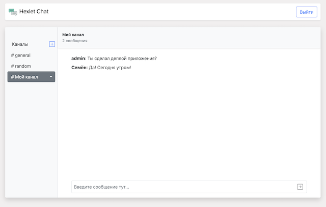

[](https://github.com/Foppp/frontend-project-lvl4/actions)

# Slack Chat App (simple version)
## Main language RU (EN optional)

* ### React and Redux Toolkit 
* React-router-dom
* React-bootstrap
* Yup
* Socket.io
* i18next
* Formik
* Axios
## [Check Example Here](https://slack-chat-hexlet.herokuapp.com/)

[](https://slack-chat-hexlet.herokuapp.com/)
## Install

```sh
$ make install
```

## Run

```sh
$ make start
# open http://localhost:5000
```
